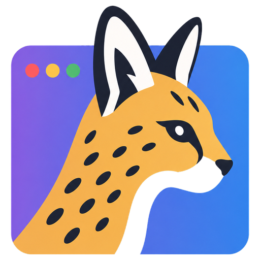
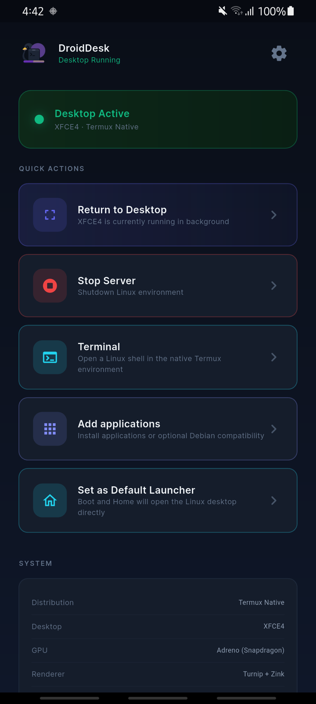

<p align="center">
  
</p>

<h1 align="center">ServalDesk</h1>

<p align="center">
Full Linux desktop on ARM64 Android — not a terminal app, not an emulator. Native kernel access, embedded X11, and an optional <strong>Android home launcher</strong> so boot and Home open the desktop directly.
</p>

**ServalDesk** (`com.servaldesk.app`) is built on top of [DroidDesk](https://github.com/orailnoor/DroidDesk). It focuses on phone-first UX: home routing, a touch-oriented XFCE layout, floating controls, and safer session start.

> [!IMPORTANT]
> ServalDesk redistributes DroidDesk-derived code under GPL-3.0. It is not affiliated with or endorsed by Termux, Termux:X11, TUR, Canonical, Ubuntu, or Serval Inc. (ITSM / helpdesk).
>
> - **This project:** <https://github.com/anugotta/ServalDesk>
> - **Upstream DroidDesk:** <https://github.com/orailnoor/DroidDesk>
> - **Termux:X11:** <https://github.com/termux/termux-x11>

## Screenshots

<p align="center">
  
  <br/>
  <em>Linux desktop (XFCE) — wallpaper, bottom dock, floating controls</em>
</p>

<p align="center">
  
  &nbsp;
  
  <br/>
  <em>Portrait desktop · ServalDesk dashboard</em>
</p>

## Features

### Home launcher mode

| Behavior | Detail |
|----------|--------|
| Boot / Home | Routes to the Linux desktop when setup is complete |
| Incomplete setup / failure | Falls back to the Flutter dashboard |
| Overlay **Dashboard** | Returns to Flutter (apps, terminal, settings, stop server) |
| Overlay **Android** | Leaves Linux for the stock Android home |
| Long-press **Android** / **Dashboard** | Opens the system default-home / role picker |

Set ServalDesk as the default home app from the dashboard (**Set as Default Launcher**), or leave the stock launcher as default and open ServalDesk from the app drawer.

### Phone desktop UX

- **Bottom dock** — Applications menu, Terminal, Files, Browser, VNC helpers
- **Top tasklist + clock** — Window list and clock on the dark panel
- **Wallpapers** — Bundled Unsplash backgrounds (see `CREDITS.txt` in assets)
- **Safe-area letterboxing** — Black borders so notches don’t clip the desktop
- **Orientation** — Desktop resizes on rotate; windows rematch the viewport
- **Trackpad / touch / soft keyboard** — Floating control bar (Trackpad is the default)

### VNC to Mac / Pi / laptop

1. On the dock, open **VNC** → **Share VNC**.
2. The display switches to **1920×1080** for a normal desktop frame.
3. Connect with a VNC client to `PHONE_IP:5901` (**Show IP** if needed).
4. **Stop VNC Share** restores the phone layout.

USB tethering is usually snappier than Wi‑Fi. Wired USB-C HDMI / DeX is the lag-free path when the hardware supports it.

### Launch reliability

- Foreground service starts before the desktop session where needed
- XFCE mobile profile installs atomically (marker written only after configs succeed)
- Dock helpers use a real bash shebang (avoids Termux `#!/bin/sh` permission errors)

> [!TIP]
> On Samsung / One UI, set ServalDesk battery usage to **Unrestricted** so the X11 session is less likely to be killed in the background.

## What this actually runs

If it runs on Ubuntu / Termux GUI packages, it can run here — for example LibreOffice, VS Code, browsers, and terminal tools. Heavy apps (Blender, local LLMs) work but are limited by phone GPU and RAM.

## How it works

- **Standalone APK (recommended):** Embedded Termux:X11 (`libXlorie.so`); Linux on `DISPLAY=:0`. No separate Termux:X11 app required.
  - **Non-root:** App-private Termux userspace + X11/TUR packages.
  - **Root:** Ubuntu filesystem via `chroot`.
  - **GPU:** Adreno → Turnip/Zink when available; otherwise Mesa software rendering.
- **Classic Termux scripts:** Optional for users who prefer Termux + Termux:X11 (see below).
- **Proot:** Optional Ubuntu/Debian/Kali container for packages not in TUR.

## Requirements

- Android phone (ARM64)
- For **standalone APK:** nothing else — X11 is embedded
- For **classic script path:** [Termux (F-Droid)](https://f-droid.org/en/packages/com.termux/) + [Termux-X11 nightly](https://github.com/termux/termux-x11/releases/tag/nightly)

### Optional monitor output

| Path | When to use |
|------|-------------|
| USB-C HDMI / DeX | Phones with DisplayPort Alt Mode — essentially lag-free |
| VNC (dock **Share VNC**) | Mac / laptop / any VNC viewer on the same network |
| Raspberry Pi VNC bridge | Headless Pi tether — see [Pi bridge](#raspberry-pi-monitor-bridge) |

## Installation

### Standalone APK (recommended)

1. Download a [release](https://github.com/anugotta/ServalDesk/releases) or build:

   ```bash
   cd app
   flutter pub get
   flutter build apk --release
   ```

   Output: `app/build/app/outputs/flutter-apk/app-release.apk`  
   Package id: `com.servaldesk.app`

2. Sideload and open **ServalDesk**.
3. Finish the setup wizard.
4. Optionally: **Set as Default Launcher** on the dashboard.
5. Use the floating bar: **Keyboard** · input mode · **Dashboard** · **Android**.

### Classic Termux path

<details>
<summary>Termux + setup script (optional)</summary>

1. Install Termux from F-Droid (not Play Store).
2. Install [Termux-X11 nightly](https://github.com/termux/termux-x11/releases/tag/nightly).
3. In Termux:

   ```bash
   curl -sL https://raw.githubusercontent.com/orailnoor/DroidDesk/main/termux-linux-setup.sh -o setup.sh
   bash setup.sh
   ```

4. Start desktop: `bash ~/start-x11.sh`, then open Termux-X11.

| Command | Purpose |
|---------|---------|
| `bash ~/start-x11.sh` | Desktop via Termux-X11 |
| `bash ~/start-vnc.sh` | Desktop via VNC |
| `bash ~/start-proot.sh` | Proot Linux shell |
| `bash ~/proot-menu-sync.sh` | Sync Proot apps to the menu |
| `bash ~/stop-linux.sh` | Stop sessions |

</details>

## Raspberry Pi monitor bridge

For phones without USB-C display output, a Pi can tether over USB and show the phone desktop with a VNC viewer (`pi-launch_phone.sh`). The dock **Share VNC** path (1920×1080) works the same for a Pi viewer on the LAN.

## Notes

> [!WARNING]
> **Disable child-process restrictions** in Developer Options on ROMs that kill background processes (MIUI, One UI, stock Android 13+). Otherwise long-running X11 sessions may die without warning.

- On-phone X11 and USB-C external display are faster than VNC.
- GPU acceleration is strongest on Adreno (Snapdragon); other GPUs fall back to software rendering.
- Electron/Chromium apps as root may need `--no-sandbox` — see [APP_TROUBLESHOOTING.md](APP_TROUBLESHOOTING.md).

## Credits

ServalDesk is maintained by [anugotta](https://github.com/anugotta/ServalDesk). Original DroidDesk by [orailnoor](https://github.com/orailnoor/DroidDesk).

Bundled wallpapers: [Unsplash](https://unsplash.com) contributors — see `app/android/app/src/main/assets/droiddesk/wallpapers/CREDITS.txt`.

## License and third-party software

ServalDesk redistributes DroidDesk-derived code under [GNU GPL version 3 only](LICENSE). See:

- [Notices and attribution](NOTICE.md)
- [Third-party software inventory](THIRD_PARTY_NOTICES.md)
- [Release compliance status](COMPLIANCE.md)
